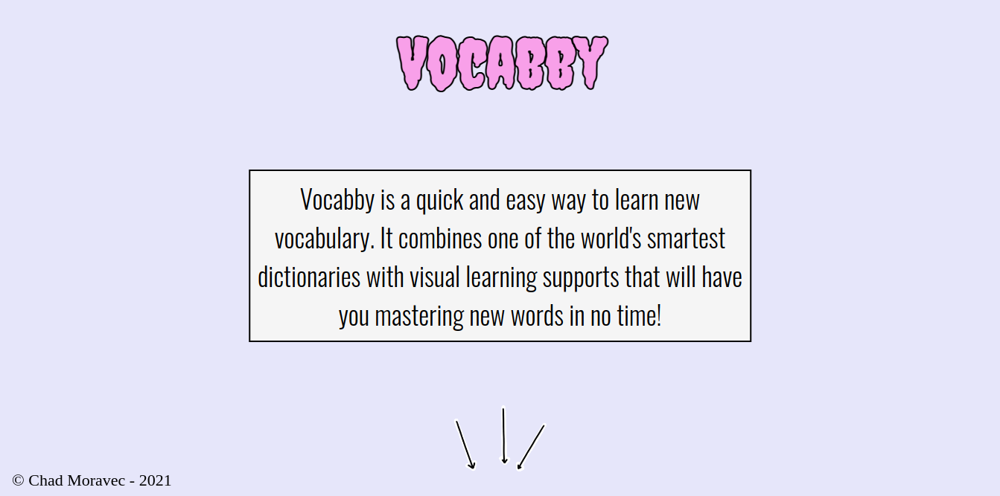
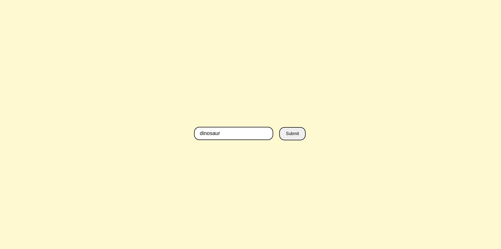
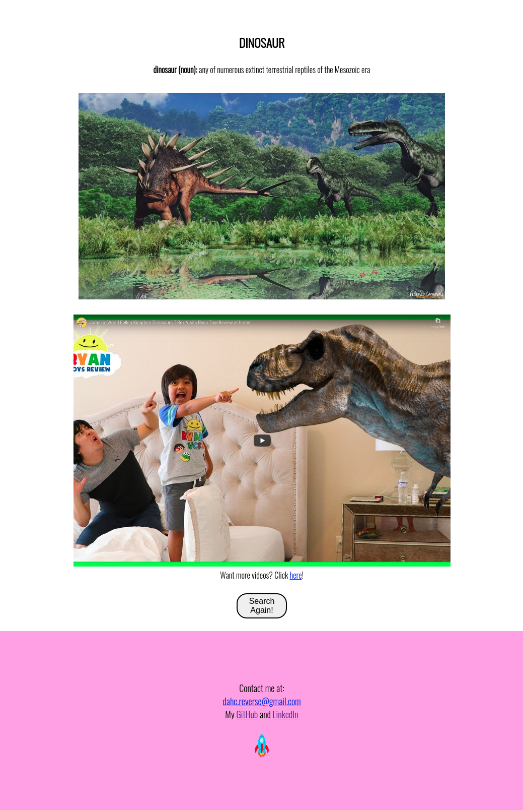

# Vocabby

Vocabby is a quick and easy way to learn new vocabulary. It combines one of the world's smartest dictionaries with visual learning supports that will have you mastering new words in no time!

## Motivation

I wanted a vocabulary app that was fun and easy to use for all ages.

## Build Status

## Screenshots
Landing Page:

Search:

Results:

## Built With

* HTML
* CSS
* JavaScript
* jQuery

## Demo

- [Live Demo](https://losmanzanos.github.io/vocabby/)

## Author

**Chad Moravec**
